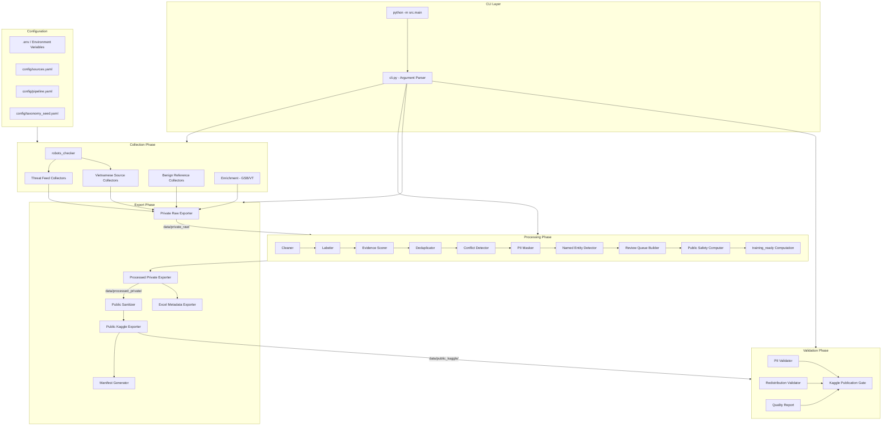
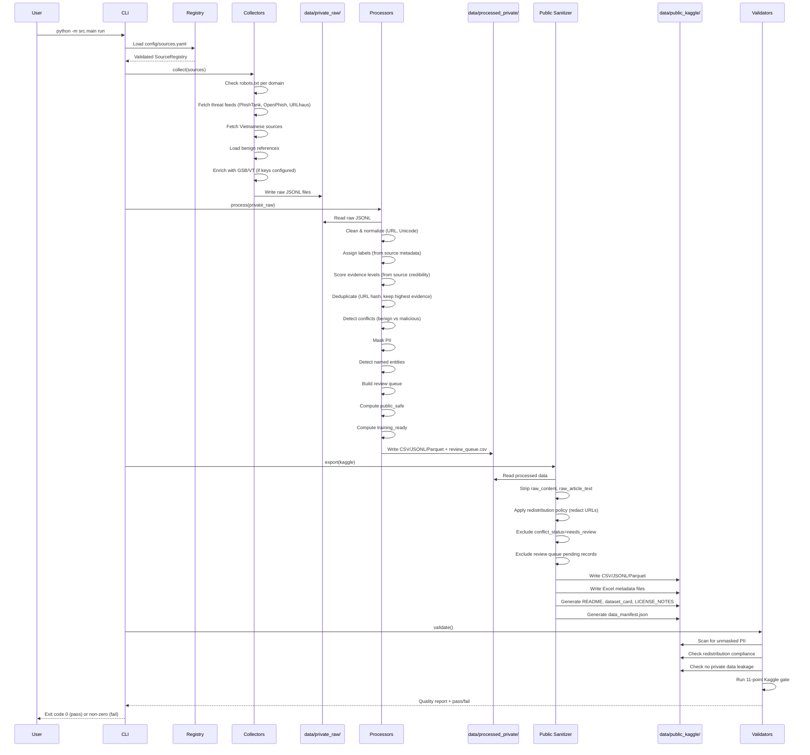
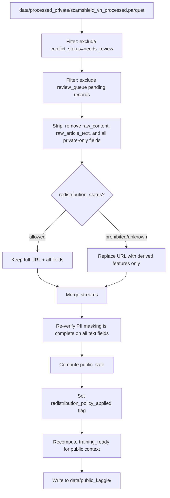

# Technical Design Document: ScamShield VN Pipeline

## Overview

ScamShield VN is a Python CLI data pipeline for building a Vietnamese online scam and phishing detection dataset. The pipeline collects data from threat feeds, Vietnamese government sources, and benign references; normalizes, cleans, deduplicates, labels, and masks PII; then exports to three output tiers: private raw, processed private, and public Kaggle-ready formats.

### Design Goals

- **Modularity**: Each pipeline stage (collect, process, export, validate) is an independent module with clear interfaces
- **Legal Compliance**: Redistribution rights and PII masking enforced at every export boundary
- **Reproducibility**: Deterministic processing with manifest checksums and versioning
- **Extensibility**: New sources and collectors added via YAML registry without code changes to the core pipeline
- **Resilience**: Retry logic, graceful degradation, and structured error reporting throughout

### Key Design Decisions

| Decision | Rationale |
|----------|-----------|
| Pydantic for schema validation | Strong typing, automatic validation, clear error messages |
| Loguru for logging | Structured JSON logging, rotation, and rich console output |
| Three-tier output separation | Prevents PII leakage; clear data governance boundaries |
| YAML source registry | Human-editable, version-controllable source definitions |
| UUID v4 record IDs | Globally unique, no sequential guessing, no collision risk |
| SHA-256 checksums in manifest | Standard integrity verification for reproducibility |
| Label→Evidence→Dedup order | Dedup needs evidence_level for tie-breaking; must be computed first |
| Seed-based Vietnamese collection | Avoids broad crawling of copyrighted/protected sites |
| No abstractive summary without review | LLM/AI-generated summaries require human_reviewed=true for training_ready |
| Heuristic name detection over NER | Lightweight, no ML dependency; false positives sent to review queue |


## Project Folder Structure

```
ScamShieldVN/
├── src/
│   ├── __init__.py
│   ├── main.py                    # CLI entry point (python -m src.main)
│   ├── cli.py                     # Argument parsing and subcommand routing
│   ├── config/
│   │   ├── __init__.py
│   │   ├── settings.py            # Pipeline configuration loader
│   │   ├── env.py                 # Environment variable and .env loading
│   │   └── registry.py            # Source registry YAML loader and validator
│   ├── collectors/
│   │   ├── __init__.py
│   │   ├── base.py                # Abstract base collector
│   │   ├── phishtank.py           # PhishTank threat feed collector
│   │   ├── openphish.py           # OpenPhish threat feed collector
│   │   ├── urlhaus.py             # URLhaus threat feed collector
│   │   ├── safe_browsing.py       # Google Safe Browsing enrichment
│   │   ├── virustotal.py          # VirusTotal enrichment
│   │   ├── vietnamese_official.py # Vietnamese government sources
│   │   ├── tin_nhiem_mang.py      # Tín Nhiệm Mạng domain checker
│   │   ├── tranco.py              # Tranco List benign domains
│   │   ├── benign_domains.py      # Curated Vietnamese benign domains
│   │   ├── benign_messages.py     # Benign message collector/generator
│   │   └── robots_checker.py      # robots.txt compliance checker
│   ├── processors/
│   │   ├── __init__.py
│   │   ├── pipeline.py            # Processing pipeline orchestrator
│   │   ├── cleaner.py             # URL normalization, text cleaning
│   │   ├── deduplicator.py        # Hash-based deduplication (runs AFTER evidence scoring)
│   │   ├── labeler.py             # Primary label assignment
│   │   ├── evidence_scorer.py     # Evidence level scoring (A-E)
│   │   ├── conflict_detector.py   # Benign vs malicious conflict detection
│   │   ├── pii_masker.py          # PII detection and masking
│   │   ├── named_entity_detector.py  # Vietnamese personal name heuristic detection
│   │   ├── review_queue.py        # Review queue management
│   │   ├── public_safety.py       # public_safe field computation
│   │   └── training_ready.py      # training_ready field computation
│   ├── exporters/
│   │   ├── __init__.py
│   │   ├── base.py                # Abstract base exporter
│   │   ├── private_raw.py         # JSONL raw exporter
│   │   ├── processed_private.py   # CSV/JSONL/Parquet private exporter
│   │   ├── public_kaggle.py       # Public sanitized exporter
│   │   ├── public_sanitizer.py    # processed_private -> public transform
│   │   ├── excel_metadata.py      # Excel metadata/sample exporter
│   │   ├── readme_generator.py    # README.md generator for Kaggle
│   │   ├── dataset_card.py        # dataset_card.md generator
│   │   └── manifest.py            # data_manifest.json generator
│   ├── validators/
│   │   ├── __init__.py
│   │   ├── quality_report.py      # Data quality report generator
│   │   ├── pii_validator.py       # PII absence verification
│   │   ├── redistribution_validator.py  # Redistribution compliance check
│   │   ├── kaggle_gate.py         # 11-point Kaggle publication gate
│   │   └── private_leak_check.py  # Private data leakage detector
│   ├── models/
│   │   ├── __init__.py
│   │   ├── source.py              # Source registry Pydantic models
│   │   ├── record.py              # Core data record models
│   │   ├── enums.py               # Shared enumerations
│   │   ├── review.py              # Review queue models
│   │   └── manifest.py            # Data manifest models
│   └── utils/
│       ├── __init__.py
│       ├── http_client.py         # Shared HTTP client with retry/rate-limit
│       ├── hashing.py             # URL hashing, SHA-256 utilities
│       ├── text.py                # Unicode normalization utilities
│       └── file_io.py             # Safe file write with atomic operations
├── config/
│   ├── sources.yaml               # Source registry definitions
│   ├── pipeline.yaml              # Pipeline configuration
│   ├── taxonomy_seed.yaml         # Vietnamese scam type taxonomy
│   ├── vietnamese_sources.yaml    # Curated seed URLs for Vietnamese official sources
│   └── pii_patterns.yaml          # PII detection regex patterns
├── data/
│   ├── private_raw/               # Raw JSONL only (gitignored)
│   ├── processed_private/         # CSV/JSONL/Parquet (gitignored)
│   └── public_kaggle/             # Public release files
├── reports/                       # Pipeline logs and quality reports
├── tests/
│   ├── __init__.py
│   ├── unit/
│   │   ├── test_registry.py
│   │   ├── test_cleaner.py
│   │   ├── test_deduplicator.py
│   │   ├── test_pii_masker.py
│   │   ├── test_labeler.py
│   │   ├── test_evidence_scorer.py
│   │   ├── test_training_ready.py
│   │   ├── test_conflict_detector.py
│   │   ├── test_named_entity_detector.py
│   │   └── test_public_safety.py
│   ├── property/
│   │   ├── test_pbt_registry.py
│   │   ├── test_pbt_cleaner.py
│   │   ├── test_pbt_deduplication.py
│   │   ├── test_pbt_pii_masker.py
│   │   ├── test_pbt_labeler.py
│   │   ├── test_pbt_evidence.py
│   │   ├── test_pbt_training_ready.py
│   │   └── test_pbt_export.py
│   └── integration/
│       ├── test_pipeline_e2e.py
│       └── test_export_formats.py
├── .env.example                   # Template for API keys
├── .gitignore
├── pyproject.toml
├── requirements.txt
└── CHANGELOG.md
```

## Module Responsibilities

| Module | Responsibility |
|--------|---------------|
| `src/main.py` | Entry point; bootstraps logging, loads config, dispatches to CLI |
| `src/cli.py` | Parses CLI arguments, routes subcommands (collect/process/export/validate/run) |
| `src/config/settings.py` | Loads `config/pipeline.yaml`, merges defaults, exposes typed config object |
| `src/config/env.py` | Loads `.env` file, reads API keys from environment, validates non-empty |
| `src/config/registry.py` | Parses `config/sources.yaml`, validates schema with Pydantic, returns `SourceRegistry` |
| `src/collectors/base.py` | Abstract `BaseCollector` with `collect()` interface, retry logic, rate limiting |
| `src/collectors/robots_checker.py` | Fetches/parses robots.txt, determines path allowance per domain |
| `src/collectors/phishtank.py` | Retrieves verified phishing URLs from PhishTank API |
| `src/collectors/openphish.py` | Retrieves current phishing feed from OpenPhish |
| `src/collectors/urlhaus.py` | Retrieves malware URLs from URLhaus API/CSV |
| `src/collectors/safe_browsing.py` | Enrichment: batch-checks URLs against Google Safe Browsing |
| `src/collectors/virustotal.py` | Enrichment: queries URL detection stats from VirusTotal |
| `src/collectors/vietnamese_official.py` | Collects case metadata from curated seed URLs in config/vietnamese_sources.yaml (no broad crawling) |
| `src/collectors/tin_nhiem_mang.py` | Collects domain status from Tín Nhiệm Mạng |
| `src/collectors/tranco.py` | Downloads top 1000 domains from Tranco List |
| `src/collectors/benign_domains.py` | Loads curated Vietnamese benign domain list |
| `src/collectors/benign_messages.py` | Produces benign message records (curated + synthetic) |
| `src/processors/pipeline.py` | Orchestrates processing stages in correct order: Clean→Label→Evidence→Dedup→Conflict→PII→NamedEntity→ReviewQueue→PublicSafety→TrainingReady |
| `src/processors/cleaner.py` | URL normalization, Unicode NFC, whitespace collapse |
| `src/processors/deduplicator.py` | Hash-based URL dedup (runs AFTER evidence scoring), merges source metadata on collision |
| `src/processors/labeler.py` | Assigns primary label from taxonomy |
| `src/processors/evidence_scorer.py` | Computes evidence_level A-E per scoring rules |
| `src/processors/conflict_detector.py` | Detects benign/malicious conflicts using merged source metadata, flags needs_review |
| `src/processors/pii_masker.py` | Scans text fields, replaces PII with typed tokens |
| `src/processors/named_entity_detector.py` | Lightweight Vietnamese personal name heuristic; flags records for review |
| `src/processors/review_queue.py` | Aggregates records requiring human review |
| `src/processors/public_safety.py` | Computes public_safe boolean based on 6 conditions |
| `src/processors/training_ready.py` | Computes training_ready boolean from 8 conditions |
| `src/exporters/private_raw.py` | Writes raw JSONL to data/private_raw/ |
| `src/exporters/processed_private.py` | Writes CSV/JSONL/Parquet to data/processed_private/ |
| `src/exporters/public_sanitizer.py` | Transforms processed_private → public-safe records |
| `src/exporters/public_kaggle.py` | Writes CSV/JSONL/Parquet to data/public_kaggle/ |
| `src/exporters/excel_metadata.py` | Writes .xlsx for metadata/sample files |
| `src/exporters/manifest.py` | Generates data_manifest.json with checksums |
| `src/validators/kaggle_gate.py` | Runs 11-point publication gate checklist |
| `src/validators/pii_validator.py` | Re-scans public output for unmasked PII |
| `src/validators/quality_report.py` | Generates Markdown quality report |


## Architecture

### High-Level Architecture Diagram




## End-to-End Data Flow



### Data Flow Summary

1. **Collect** → raw records written to `data/private_raw/*.jsonl` (one file per source)
2. **Process** → cleaned, labeled records written to `data/processed_private/scamshield_vn_processed.{csv,jsonl,parquet}` + `review_queue.csv`
3. **Export (Public)** → sanitized records from processed_private transformed and written to `data/public_kaggle/scamshield_vn_public.{csv,jsonl,parquet}` + metadata Excel + docs
4. **Validate** → reads public_kaggle, produces quality report and Kaggle gate checklist


## Components and Interfaces

### 6.1 Source Registry Schema

```yaml
# config/sources.yaml
sources:
  - source_id: "phishtank_verified"
    source_name: "PhishTank Verified Phishing"
    source_url: "https://phishtank.org"
    source_type: "threat_feed"           # enum: official_government, threat_feed, news_media, community_report, benign_reference, international_organization
    credibility_level: "high"            # enum: official, high, medium, low, unknown
    license_note: "Free for non-commercial use"
    access_method: "public_api"          # enum: public_api, public_csv, public_rss, public_webpage, manual_curated, api_key_required
    redistribution_status: "allowed"     # enum: allowed, prohibited, unknown
    rate_limit_rps: 1.0                  # optional: requests per second
    requires_api_key: false              # optional
    enabled: true                        # optional, default true
```

**Pydantic model** (`src/models/source.py`):

```python
class SourceType(str, Enum):
    OFFICIAL_GOVERNMENT = "official_government"
    THREAT_FEED = "threat_feed"
    NEWS_MEDIA = "news_media"
    COMMUNITY_REPORT = "community_report"
    BENIGN_REFERENCE = "benign_reference"
    INTERNATIONAL_ORGANIZATION = "international_organization"

class CredibilityLevel(str, Enum):
    OFFICIAL = "official"
    HIGH = "high"
    MEDIUM = "medium"
    LOW = "low"
    UNKNOWN = "unknown"

class AccessMethod(str, Enum):
    PUBLIC_API = "public_api"
    PUBLIC_CSV = "public_csv"
    PUBLIC_RSS = "public_rss"
    PUBLIC_WEBPAGE = "public_webpage"
    MANUAL_CURATED = "manual_curated"
    API_KEY_REQUIRED = "api_key_required"

class RedistributionStatus(str, Enum):
    ALLOWED = "allowed"
    PROHIBITED = "prohibited"
    UNKNOWN = "unknown"

class SourceEntry(BaseModel):
    source_id: str
    source_name: str
    source_url: HttpUrl
    source_type: SourceType
    credibility_level: CredibilityLevel
    license_note: str
    access_method: AccessMethod
    redistribution_status: RedistributionStatus
    rate_limit_rps: float = 1.0
    requires_api_key: bool = False
    enabled: bool = True
```


### 6.2 Collector Design

#### Base Collector Interface

```python
class BaseCollector(ABC):
    def __init__(self, source: SourceEntry, config: PipelineConfig, http_client: HttpClient):
        self.source = source
        self.config = config
        self.http = http_client

    @abstractmethod
    async def collect(self) -> list[RawRecord]:
        """Fetch data from source and return raw records."""
        ...

    def pre_collect_checks(self) -> bool:
        """Run robots.txt and legal compliance checks. Returns False if source should be skipped."""
        ...
```

#### Threat Feed Collectors

| Collector | Source | Access Method | Output Fields |
|-----------|--------|---------------|---------------|
| `PhishTankCollector` | PhishTank API | public_api / api_key_required | source_id, url, verification_status, submission_date |
| `OpenPhishCollector` | OpenPhish feed | public_csv | source_id, url, collection_timestamp |
| `URLhausCollector` | URLhaus API/CSV | public_api / public_csv | source_id, url, threat_type, date_added |

#### Enrichment Collectors

| Collector | Source | Batch Size | Output Fields |
|-----------|--------|------------|---------------|
| `SafeBrowsingEnricher` | Google Safe Browsing | 500 URLs/request | threat_match (boolean + threat type) |
| `VirusTotalEnricher` | VirusTotal API | 1 URL/request (rate limited) | positives_count, total_engines |

#### Vietnamese Source Collectors

| Collector | Source | Output Fields |
|-----------|--------|---------------|
| `VietnameseOfficialCollector` | Government cyber reports (seed URLs from config/vietnamese_sources.yaml) | source_id, case_summary, scam_type, date_reported, source_url, summary_method |
| `TinNhiemMangCollector` | Tín Nhiệm Mạng | source_id, domain, status, date_checked |

**Important**: `VietnameseOfficialCollector` operates exclusively from manually curated seed URLs defined in `config/vietnamese_sources.yaml`. It does NOT perform broad crawling. Each seed URL is a specific page from official Vietnamese cybersecurity authorities, government portals, or bank warning pages. The collector respects robots.txt, ToS, and rate limits per domain.

#### Benign Data Collectors

| Collector | Source | Output Fields |
|-----------|--------|---------------|
| `TrancoCollector` | Tranco List (top 1000) | source_id, domain, category="international", verification_method="tranco_ranking" |
| `BenignDomainsCollector` | Curated Vietnamese list | source_id, domain, category, organization_name, verification_method |
| `BenignMessagesCollector` | Curated/synthetic messages | message_id, text_sanitized, benign_message_type, synthetic, source_type, human_reviewed, evidence_level |

#### Robots.txt Checker

```python
class RobotsChecker:
    def __init__(self, http_client: HttpClient, timeout: int = 10):
        self._cache: dict[str, RobotFileParser] = {}

    def is_allowed(self, url: str, user_agent: str = "*") -> bool:
        """Check if URL path is allowed by robots.txt. Returns False on timeout or fetch failure."""
        ...
```


### 6.3 Processing Pipeline Design

The processing pipeline executes stages in a fixed order. The key insight is that **Labeling and Evidence Scoring must happen BEFORE Deduplication**, because the deduplicator needs evidence_level to decide which duplicate to keep.

```mermaid
graph LR
    RAW[Raw JSONL] --> CLEAN[1. Cleaning & Normalization]
    CLEAN --> LABEL[2. Labeling]
    LABEL --> EVIDENCE[3. Evidence Scoring]
    EVIDENCE --> DEDUP[4. Deduplication]
    DEDUP --> CONFLICT[5. Conflict Detection]
    CONFLICT --> PII[6. PII Masking]
    PII --> NAMED[7. Named Entity Detection]
    NAMED --> REVIEW[8. Review Queue]
    REVIEW --> PUBSAFE[9. Public Safety Computation]
    PUBSAFE --> TRAIN[10. training_ready Computation]
    TRAIN --> OUTPUT[Processed Output]
```



#### Stage 1: Cleaning & Normalization

```python
class Cleaner:
    def normalize_url(self, url: str) -> str:
        """Lowercase scheme+domain, remove trailing slash, remove default ports, sort query params."""
    
    def normalize_text(self, text: str) -> str:
        """NFC normalize, strip Cc/Cf control chars (keep \\n\\t\\r), collapse whitespace."""
    
    def clean_record(self, record: RawRecord) -> CleanedRecord:
        """Apply all normalizations. Set normalization_error flag on URL parse failure."""
```

#### Stage 2: Labeling

```python
class Labeler:
    VALID_LABELS = [
        "phishing_url", "malware_url", "scam_case", "scam_pattern",
        "suspicious", "community_reported_unverified", "benign_url",
        "benign_message", "unknown"
    ]
    
    def assign_label(self, record: CleanedRecord, taxonomy: ScamTaxonomy) -> LabeledRecord:
        """
        Assign exactly one primary label based on source_type and record metadata.
        Assign 0-5 scam_type values from Vietnamese taxonomy.
        Strip personal names from label fields.
        Default to "unknown" if insufficient metadata.
        """
```

#### Stage 3: Evidence Scoring

Runs BEFORE deduplication so that dedup can use evidence_level for tie-breaking.

```python
class EvidenceScorer:
    def score(self, record: LabeledRecord, registry: SourceRegistry) -> ScoredRecord:
        """
        Assigns evidence_level A-E based on:
          A: official/threat_feed source + confirmed verification
          B: high credibility OR 2+ corroborating sources
          C: community_report with URL/screenshot/date
          D: low credibility, no corroboration
          E: no source_id or unknown credibility
        Also caps synthetic benign messages at evidence_level B max.
        """
```

#### Stage 4: Deduplication

Runs AFTER labeling and evidence scoring. When merging duplicates, preserves full source-level metadata so ConflictDetector can later detect benign/malicious conflicts.

```python
class Deduplicator:
    def compute_url_hash(self, normalized_url: str) -> str:
        """SHA-256 hash of normalized URL for dedup key."""
    
    def deduplicate(self, records: list[ScoredRecord]) -> list[DedupedRecord]:
        """
        Group by url_hash. Keep record with highest evidence_level (A > B > C > D > E).
        If tied, keep record with earliest first_seen timestamp.
        
        CRITICAL: When merging duplicates, preserve source-level metadata:
        - source_ids: merged list of all source_ids from duplicate group
        - source_labels: dict mapping source_id -> label assigned by that source
        - source_evidence_levels: dict mapping source_id -> evidence_level from that source
        - source_types: dict mapping source_id -> source_type (threat_feed, benign_reference, etc.)
        - source_threat_types: dict mapping source_id -> threat_type if applicable
        - first_seen: earliest collection_timestamp across all duplicates
        - last_seen: latest collection_timestamp across all duplicates
        
        Assign UUID v4 record_id to each deduplicated output.
        """
```

#### Stage 5: Conflict Detection

Uses merged source metadata from dedup to identify records appearing in both benign and malicious sources.

```python
class ConflictDetector:
    def detect(self, records: list[DedupedRecord]) -> list[DedupedRecord]:
        """
        For records where source_types includes BOTH benign_reference AND threat_feed/official_government:
        OR where source_labels contains BOTH benign_url AND (phishing_url OR malware_url):
        - Set conflict_status = "needs_review"
        - Set conflict_reason = f"Record has contradicting sources: {benign_sources} vs {malicious_sources}"
        - Will be added to review queue in Stage 8
        """
```

#### Stage 6: PII Masking

```python
class PIIMasker:
    PII_PATTERNS: dict[str, re.Pattern]  # Loaded from config/pii_patterns.yaml
    TOKEN_MAP = {
        "phone": "[PHONE_REDACTED]",
        "bank_account": "[BANK_ACCOUNT_REDACTED]",
        "email": "[EMAIL_REDACTED]",
        "national_id": "[ID_REDACTED]",
        "address": "[ADDRESS_REDACTED]",
        "otp": "[OTP_REDACTED]",
        "password": "[PASSWORD_REDACTED]",
        "card": "[CARD_REDACTED]",
    }
    
    def mask_record(self, record: DedupedRecord) -> MaskedRecord:
        """
        Scan free-text fields. Replace PII with typed tokens.
        Set pii_detected=True if any found. Populate pii_summary counts.
        Set pii_redacted=True after successful masking.
        On error: add to review queue with reason "pii_masking_error".
        """
```

#### Stage 7: Named Entity Detection

Lightweight heuristic to detect personal names in Vietnamese text, flagging records for review.

```python
class NamedEntityDetector:
    """
    Detects possible personal names in Vietnamese text using heuristics:
    - Patterns: anh/chị/ông/bà + Capitalized_Name
    - Bank account ownership patterns: "đứng tên [Name]"
    - Accusation patterns: "[Name] lừa đảo"
    - Known Vietnamese name patterns (2-4 syllables, capitalized)
    
    Does NOT make final decisions. Only flags for review queue.
    """
    
    def detect_names(self, text: str) -> list[str]:
        """Returns list of possible name spans found in text."""
    
    def flag_record(self, record: MaskedRecord) -> MaskedRecord:
        """
        If names detected, set possible_named_individual=True.
        Record will be added to review queue with reason "possible_named_individual".
        """
```

#### Stage 8: Review Queue

```python
class ReviewQueueBuilder:
    def should_review(self, record: MaskedRecord) -> list[str]:
        """
        Returns list of review reasons. Record added to queue if any of:
        - evidence_level in (C, D, E)
        - redistribution_status = "unknown"
        - conflict_status = "needs_review"
        - PII masking error
        - possible_named_individual = True
        - Contains unmasked phone/bank numbers (masking incomplete)
        - summary_method = "extractive" AND human_reviewed = False
        - summary_method = "abstractive" AND human_reviewed = False
        """
    
    def build_queue(self, records: list[MaskedRecord]) -> ReviewQueue:
        """Aggregate all records requiring review into review_queue.csv format."""
```

#### Stage 9: Public Safety Computation

```python
class PublicSafetyComputer:
    """
    Determines whether a record is safe for public output.
    This is a separate module (src/processors/public_safety.py) because
    processed_private may still contain sensitive provenance fields.
    """
    
    def compute(self, record: MaskedRecord, review_queue: ReviewQueue) -> bool:
        """
        Returns public_safe=True ONLY IF ALL conditions met:
        1. No raw_content or raw_article_text will remain after sanitization
        2. PII is absent (pii_detected=False) OR fully redacted (pii_redacted=True)
        3. Redistribution policy can be satisfied (status=allowed OR features derivable)
        4. conflict_status is empty or "resolved"
        5. Record is NOT pending in review_queue (or requires_action="approve")
        6. No prohibited/private fields that cannot be stripped
        """
```

#### Stage 10: training_ready Computation

```python
class TrainingReadyComputer:
    def compute(self, record: MaskedRecord, review_queue: ReviewQueue) -> bool:
        """
        Returns True ONLY IF ALL conditions met:
        1. public_safe = True
        2. pii_detected=False OR pii_redacted=True
        3. redistribution_status="allowed" OR redistribution_policy_applied=True
        4. conflict_status is empty or "resolved"
        5. evidence_level in (A, B)
        6. record NOT pending in review_queue (not present OR requires_action="approve")
        7. summary_method != "abstractive" unless human_reviewed=True
        8. summary_method != "extractive" unless human_reviewed=True
        """
```


### 6.4 Public Sanitizer Flow

The public sanitizer transforms `data/processed_private/` → `data/public_kaggle/`. It is NOT a simple file copy; it performs final field stripping, redistribution policy enforcement, PII verification, public_safe computation, and training_ready recalculation.

**Important**: `data/processed_private/` is internal-only and may still contain sensitive provenance fields (raw_content, raw_article_text). The public sanitizer must never assume processed_private is already public-safe.



**Derived features for redistribution-restricted records:**
- `domain_hash` (SHA-256 of domain)
- `url_length` (integer)
- `path_length` (integer)
- `query_length` (integer)
- `tld` (top-level domain extracted via tldextract)
- `has_ip_address` (boolean)
- `has_punycode` (boolean)
- `has_url_shortener` (boolean)
- `threat_type` (from label)
- `evidence_level`
- `source_id`


### 6.5 Export Design

#### Output Format Matrix

| Output Directory | CSV | JSONL | Parquet | Excel | Notes |
|-----------------|-----|-------|---------|-------|-------|
| `data/private_raw/` | ❌ | ✅ | ❌ | ❌ | One JSONL per source |
| `data/processed_private/` | ✅ | ✅ | ✅ | ❌ | Full processed dataset |
| `data/public_kaggle/` | ✅ | ✅ | ✅ | ✅ (metadata only) | Public release |

#### Excel Metadata Files (public_kaggle/ only)

| File Name | Content | Max Rows |
|-----------|---------|----------|
| `source_registry.xlsx` | All source entries with metadata | All sources |
| `scam_taxonomy.xlsx` | Vietnamese scam type taxonomy | 18+ categories |
| `risk_signals.xlsx` | Risk signal definitions | All signals |
| `data_dictionary.xlsx` | Column definitions for all output files | All columns |
| `review_queue_summary.xlsx` | Aggregated review queue statistics | Summary only |
| `sample_records.xlsx` | Sample from main dataset | 1000 max |

#### File Naming Convention

```
data/private_raw/
  ├── phishtank_verified_20240115.jsonl
  ├── openphish_feed_20240115.jsonl
  ├── urlhaus_malware_20240115.jsonl
  ├── vietnamese_official_20240115.jsonl
  ├── tin_nhiem_mang_20240115.jsonl
  ├── tranco_top1000_20240115.jsonl
  ├── benign_domains_vn_20240115.jsonl
  └── benign_messages_20240115.jsonl

data/processed_private/
  ├── scamshield_vn_processed.csv
  ├── scamshield_vn_processed.jsonl
  ├── scamshield_vn_processed.parquet
  ├── review_queue.csv
  └── benign_messages_sanitized.csv

data/public_kaggle/
  ├── scamshield_vn_public.csv
  ├── scamshield_vn_public.jsonl
  ├── scamshield_vn_public.parquet
  ├── benign_messages_sanitized.csv
  ├── source_registry.xlsx
  ├── scam_taxonomy.xlsx
  ├── risk_signals.xlsx
  ├── data_dictionary.xlsx
  ├── review_queue_summary.xlsx
  ├── sample_records.xlsx
  ├── README.md
  ├── dataset_card.md
  ├── LICENSE_NOTES.md
  └── data_manifest.json
```


### 6.6 Validation and Kaggle Publication Gate

The Kaggle publication gate runs 11 pass/fail checks. ALL must pass for publication.

```python
class KaggleGate:
    def run_checks(self, public_dir: Path) -> GateResult:
        """
        Returns GateResult with 11 check outcomes:
        1. pii_absence: No unmasked PII in any free-text field
        2. license_compliance: All sources have valid license_note
        3. redistribution_compliance: No full URLs from prohibited/unknown sources
        4. conflict_excluded: No records with conflict_status=needs_review
        5. private_data_excluded: No files from private_raw or processed_private referenced
        6. copyright_excluded: No raw_article_text, no 120+ word contiguous copyrighted blocks
        7. extractive_reviewed: No summary_method=extractive + human_reviewed=false
        8. dataset_card_present: dataset_card.md exists and is non-empty
        9. readme_present: README.md exists and is non-empty
        10. manifest_present: data_manifest.json exists and is valid JSON
        11. minimum_records: At least 100 training_ready=true records
        """
```

**Gate Result Output Format** (Markdown checklist):

```markdown
# Kaggle Publication Gate

| # | Check | Status | Details |
|---|-------|--------|---------|
| 1 | PII absence | ✅ PASS | 0 unmasked PII instances |
| 2 | License compliance | ✅ PASS | All 12 sources compliant |
| ... | ... | ... | ... |
| 11 | Minimum records | ✅ PASS | 2,847 training-ready records |

**Overall: PASS** (11/11 checks passed)
```


### 6.7 CLI Command Design

```
python -m src.main <subcommand> [options]

Subcommands:
  collect     Collect data from sources
  process     Clean, normalize, label, and score collected data
  export      Export processed data to output formats
  validate    Run quality checks and Kaggle publication gate
  run         Execute full pipeline (collect → process → export → validate)

Global Options:
  --config PATH        Custom path to sources.yaml (default: config/sources.yaml)
  --output-dir PATH    Custom base output directory (default: ./data)
  --verbose            Set log level to DEBUG

Subcommand Options:
  collect:
    --source SOURCE_ID   Collect from specific source only (default: all)

  export:
    --target TARGET      Export target: "kaggle" (public only), "all" (default: all)

  run:
    (inherits all global options)
```

**CLI Implementation** (`src/cli.py`):

```python
import argparse

def build_parser() -> argparse.ArgumentParser:
    parser = argparse.ArgumentParser(prog="python -m src.main", description="ScamShield VN Pipeline")
    parser.add_argument("--config", default="config/sources.yaml", help="Path to source registry")
    parser.add_argument("--output-dir", default="./data", help="Base output directory")
    parser.add_argument("--verbose", action="store_true", help="Enable DEBUG logging")
    
    subparsers = parser.add_subparsers(dest="command", required=True)
    
    collect_parser = subparsers.add_parser("collect")
    collect_parser.add_argument("--source", help="Collect from specific source_id")
    
    process_parser = subparsers.add_parser("process")
    
    export_parser = subparsers.add_parser("export")
    export_parser.add_argument("--target", choices=["kaggle", "all"], default="all")
    
    validate_parser = subparsers.add_parser("validate")
    
    run_parser = subparsers.add_parser("run")
    
    return parser
```

**Exit Codes:**
- `0`: Success
- `1`: Fatal pipeline error
- `2`: Invalid CLI arguments / usage error


## Data Models

### 7.1 Exact Schemas for All Output Files

#### Raw Record Schema (data/private_raw/*.jsonl)

```python
class RawRecord(BaseModel):
    """Schema for raw JSONL records in data/private_raw/"""
    source_id: str
    collection_timestamp: datetime
    record_type: str                      # "url", "case", "domain", "message"
    
    # URL records
    url: Optional[str] = None
    verification_status: Optional[str] = None
    submission_date: Optional[datetime] = None
    threat_type: Optional[str] = None
    date_added: Optional[datetime] = None
    
    # Case records
    case_summary: Optional[str] = None
    scam_type: Optional[str] = None
    date_reported: Optional[datetime] = None
    source_url: Optional[str] = None
    
    # Domain records
    domain: Optional[str] = None
    status: Optional[str] = None          # scam, phishing, malware, suspicious, unverified
    date_checked: Optional[datetime] = None
    category: Optional[str] = None
    organization_name: Optional[str] = None
    verification_method: Optional[str] = None
    
    # Message records
    message_id: Optional[str] = None
    text_sanitized: Optional[str] = None
    benign_message_type: Optional[str] = None
    synthetic: Optional[bool] = None
    source_type: Optional[str] = None
    human_reviewed: Optional[bool] = None
    
    # Enrichment fields
    threat_match: Optional[bool] = None
    positives_count: Optional[int] = None
    total_engines: Optional[int] = None
    
    # Raw content (private only)
    raw_content: Optional[str] = None
    raw_article_text: Optional[str] = None
```

#### Processed Record Schema (data/processed_private/)

```python
class ProcessedRecord(BaseModel):
    """Schema for processed records in data/processed_private/"""
    record_id: str                         # UUID v4
    source_ids: list[str]                  # Merged from dedup
    first_seen: datetime
    last_seen: datetime
    record_type: str
    
    # Merged source metadata (preserved during deduplication for conflict detection)
    source_labels: Optional[dict[str, str]] = None       # source_id -> label from that source
    source_evidence_levels: Optional[dict[str, str]] = None  # source_id -> evidence_level
    source_types: Optional[dict[str, str]] = None        # source_id -> source_type
    source_threat_types: Optional[dict[str, str]] = None # source_id -> threat_type if applicable
    
    # Normalized URL fields
    url: Optional[str] = None
    url_hash: Optional[str] = None         # SHA-256 of normalized URL
    normalization_error: bool = False
    
    # Domain fields
    domain: Optional[str] = None
    tld: Optional[str] = None
    has_ip_address: bool = False
    has_punycode: bool = False
    has_url_shortener: bool = False
    url_length: Optional[int] = None
    path_length: Optional[int] = None
    query_length: Optional[int] = None
    
    # Case/content fields
    case_summary: Optional[str] = None
    summary_method: Optional[str] = None   # manual, extractive, abstractive, rule_based
    human_reviewed: bool = False
    text_sanitized: Optional[str] = None
    benign_message_type: Optional[str] = None
    synthetic: Optional[bool] = None
    
    # Classification fields
    label: str                             # Primary label (one of 9 values)
    scam_types: list[str] = []             # 0-5 taxonomy values
    evidence_level: str                    # A, B, C, D, E
    
    # Conflict fields
    conflict_status: Optional[str] = None  # needs_review, resolved, None
    conflict_reason: Optional[str] = None
    reviewed_by: Optional[str] = None
    reviewed_at: Optional[datetime] = None
    
    # PII fields
    pii_detected: bool = False
    pii_redacted: bool = False
    pii_summary: Optional[dict[str, int]] = None
    possible_named_individual: bool = False  # Flagged by NamedEntityDetector
    
    # Source metadata
    credibility_level: str
    source_type: str
    redistribution_status: str
    
    # Enrichment
    threat_match: Optional[bool] = None
    positives_count: Optional[int] = None
    total_engines: Optional[int] = None
    
    # Training readiness
    public_safe: bool = False
    training_ready: bool = False
    redistribution_policy_applied: bool = False
    
    # Raw content (processed_private only, stripped from public)
    raw_content: Optional[str] = None
    raw_article_text: Optional[str] = None
```


#### Public Kaggle Record Schema (data/public_kaggle/)

```python
class PublicRecord(BaseModel):
    """Schema for public records in data/public_kaggle/"""
    record_id: str
    source_ids: list[str]
    first_seen: datetime
    last_seen: datetime
    record_type: str
    
    # URL fields (conditional on redistribution_status)
    url: Optional[str] = None              # Only if redistribution_status=allowed
    domain_hash: Optional[str] = None      # SHA-256 of domain (if URL redacted)
    url_length: Optional[int] = None
    path_length: Optional[int] = None
    query_length: Optional[int] = None
    tld: Optional[str] = None
    has_ip_address: bool = False
    has_punycode: bool = False
    has_url_shortener: bool = False
    
    # Case/content fields (no raw_content, no raw_article_text)
    summary_vi: Optional[str] = None       # PII-masked case summary
    source_url: Optional[str] = None
    published_date: Optional[datetime] = None
    text_sanitized: Optional[str] = None   # PII-masked message text
    benign_message_type: Optional[str] = None
    synthetic: Optional[bool] = None
    summary_method: Optional[str] = None
    human_reviewed: bool = False
    
    # Classification
    label: str
    scam_types: list[str] = []
    risk_signals: list[str] = []
    evidence_level: str
    
    # Compliance fields
    redistribution_status: str
    redistribution_policy_applied: bool = False
    training_ready: bool = False
    
    # Source metadata
    source_type: str
    credibility_level: str
```

#### Benign Messages Schema (benign_messages_sanitized.csv)

```python
class BenignMessageRecord(BaseModel):
    """Schema for benign_messages_sanitized.csv"""
    message_id: str
    text_sanitized: str                    # PII-masked
    benign_message_type: str               # otp_warning, delivery_notification, bank_education, promotion, system_notification, other
    synthetic: bool
    source_type: str                       # official_source, derived, manually_curated
    human_reviewed: bool
    source_ids: list[str]
    evidence_level: str                    # A or B (B max for synthetic)
    collected_at: datetime
```

#### Review Queue Schema (review_queue.csv)

```python
class ReviewQueueRecord(BaseModel):
    """Schema for review_queue.csv"""
    record_id: str
    review_reason: list[str]               # List of reasons
    source_ids: list[str]
    label: str
    evidence_level: str
    conflict_status: Optional[str] = None
    pii_detected: bool = False
    requires_action: str                   # approve, reject, edit, escalate
    reviewer_assigned: Optional[str] = None
    reviewed_by: Optional[str] = None
    reviewed_at: Optional[datetime] = None
    review_notes: Optional[str] = None
```

#### Data Manifest Schema (data_manifest.json)

```python
class ManifestFile(BaseModel):
    file_name: str
    row_count: int
    file_size_bytes: int
    sha256_checksum: str

class DataManifest(BaseModel):
    """Schema for data_manifest.json"""
    dataset_version: str                   # Semantic version (e.g., "1.0.0")
    build_date: str                        # ISO 8601
    pipeline_version: str
    total_record_count: int
    training_ready_count: int
    files: list[ManifestFile]
    source_snapshot_date: str              # ISO 8601
    sources_used: list[str]                # source_ids
```


## Error Handling

### Error Classification

| Category | Severity | Behavior | Exit Code |
|----------|----------|----------|-----------|
| Configuration Error | FATAL | Stop pipeline immediately | 1 |
| Source Unavailable | WARN | Skip source, continue | 0 (logged) |
| Network Timeout | WARN | Retry with backoff, then skip | 0 (logged) |
| Rate Limit (429) | WARN | Wait and retry | 0 (logged) |
| HTTP 4xx Client Error | WARN | Skip without retry | 0 (logged) |
| HTTP 5xx Server Error | WARN | Retry 3x with exponential backoff | 0 (logged) |
| Parse Error | WARN | Skip record, log | 0 (logged) |
| PII Masking Error | WARN | Add to review queue, exclude from public | 0 (logged) |
| Validation Failure | ERROR | Report and exit non-zero | 1 |
| File Write Error | ERROR | Log, skip file, continue | 1 (at end) |
| robots.txt Timeout | WARN | Treat as disallowed, skip | 0 (logged) |

### Retry Strategy

```python
# Using tenacity library
@retry(
    stop=stop_after_attempt(3),
    wait=wait_exponential(multiplier=2, min=2, max=30),
    retry=retry_if_exception_type((HTTPServerError, ConnectionError, TimeoutError)),
    before_sleep=log_retry_attempt
)
async def fetch_with_retry(url: str) -> Response:
    ...
```

### Logging Architecture

```python
from loguru import logger

# Configuration in src/main.py
def setup_logging(verbose: bool, output_dir: Path):
    logger.remove()  # Remove default handler
    
    # Console output (human-readable with Rich formatting)
    log_level = "DEBUG" if verbose else "INFO"
    logger.add(sys.stdout, level=log_level, format="{time:HH:mm:ss} | {level:<7} | {message}")
    
    # File output (structured JSON)
    log_file = output_dir / "reports" / f"pipeline_{datetime.now():%Y%m%d_%H%M%S}.log"
    logger.add(log_file, level="DEBUG", serialize=True)
```

### Structured Log Events

```json
{
  "timestamp": "2024-01-15T10:30:00Z",
  "level": "INFO",
  "event_type": "collection_complete",
  "source_id": "phishtank_verified",
  "records_fetched": 1234,
  "duration_seconds": 5.2,
  "error_message": null
}
```

```json
{
  "timestamp": "2024-01-15T10:35:00Z",
  "level": "INFO",
  "event_type": "processing_summary",
  "records_cleaned": 5000,
  "duplicates_removed": 234,
  "pii_items_masked": 89,
  "labels_assigned": 4766,
  "conflicts_detected": 12,
  "training_ready_count": 3200
}
```


## Security and Privacy Controls

### Data Classification

| Directory | Classification | Access Control | Git Status |
|-----------|---------------|----------------|------------|
| `data/private_raw/` | CONFIDENTIAL | Local only | .gitignored |
| `data/processed_private/` | INTERNAL | Local only | .gitignored |
| `data/public_kaggle/` | PUBLIC | Publishable | Tracked |
| `config/` | INTERNAL | Version controlled | Tracked |
| `.env` | SECRET | Local only | .gitignored |

### Privacy Controls

1. **PII flow**: `processed_private/` contains PII-masked text BUT may still retain sensitive provenance fields (raw_content, raw_article_text) for internal analysis. It is NOT public-safe.
2. **Public sanitizer performs final checks**: The public_sanitizer reads from `processed_private/`, strips raw_content/raw_article_text, applies redistribution policy, verifies PII masking, computes public_safe, and recomputes training_ready before writing to `public_kaggle/`.
3. **Double-check**: Validator independently re-scans `public_kaggle/` for any remaining PII
4. **Masking tokens**: Type-specific (`[PHONE_REDACTED]`) to preserve analytical value without exposing data
5. **No personal names in labels**: Labeler strips personal names before label assignment
6. **Named entity detection**: Records with possible personal names are flagged and sent to review queue
7. **Review queue**: Records with PII masking errors or named entities are excluded from public output until human review

### Secrets Management

- API keys loaded via `python-dotenv` from `.env` file
- Environment variables take precedence over `.env` values
- Keys validated as non-empty on load; empty = treated as not configured
- No secrets in code, config YAML, or version control
- `.env.example` provided with placeholder values

### Redistribution Enforcement

- Records from `prohibited`/`unknown` sources get URL redacted → only derived features exported
- `redistribution_policy_applied` flag set to `True` on redacted records
- Validator independently verifies no full URLs leak from restricted sources

### File System Safety

- `.gitignore` auto-created/appended to exclude `data/private_raw/` and `data/processed_private/`
- `PRIVATE_DATA_WARNING.md` generated in `data/private_raw/`
- Startup warning logged if private directories are not gitignored
- Atomic file writes prevent partial/corrupted output on failure


## Correctness Properties

*A property is a characteristic or behavior that should hold true across all valid executions of a system — essentially, a formal statement about what the system should do. Properties serve as the bridge between human-readable specifications and machine-verifiable correctness guarantees.*

### Property 1: Source Registry Validation Completeness

*For any* source entry dictionary, validation SHALL pass if and only if all required fields (source_id, source_name, source_url, source_type, credibility_level, license_note, access_method, redistribution_status) are present AND each enum field contains a value from its defined valid set. Conversely, for any source entry missing a required field or containing an invalid enum value, validation SHALL fail with an error identifying the specific invalid field.

**Validates: Requirements 1.3, 1.4, 1.5, 1.6, 1.7, 1.8, 1.9**

### Property 2: Source ID Uniqueness Enforcement

*For any* list of source entries where two or more entries share the same source_id value, the registry validation SHALL reject the list with an error identifying the duplicate source_id.

**Validates: Requirements 1.10**

### Property 3: Redistribution Policy Enforcement

*For any* record with redistribution_status="prohibited" or "unknown", the public Kaggle export SHALL NOT contain the full URL or raw_content for that record. The public output SHALL only include derived features (domain_hash, url_length, path_length, query_length, tld, has_ip_address, has_punycode, has_url_shortener, threat_type, evidence_level, source_id) and redistribution_policy_applied SHALL be set to true.

**Validates: Requirements 2.6, 9.6, 9.7**

### Property 4: URL Normalization Idempotence

*For any* valid URL string, applying URL normalization twice SHALL produce the same result as applying it once (i.e., normalize(normalize(url)) == normalize(url)). Additionally, normalization SHALL preserve the scheme, domain identity, path, and query parameters while only changing representation (lowercasing, port removal, slash trimming, param sorting).

**Validates: Requirements 6.1**

### Property 5: Text Normalization Preserves Vietnamese and is Idempotent

*For any* Unicode text string containing Vietnamese diacritical marks (e.g., ắ, ề, ọ, ũ, ơ), text normalization SHALL preserve all Vietnamese characters. Furthermore, for any text, applying normalization twice SHALL produce the same result as applying it once (idempotence).

**Validates: Requirements 6.3**

### Property 6: Deduplication Correctness

*For any* set of records sharing the same normalized URL hash, deduplication SHALL retain exactly one record — the one with the highest evidence_level (A > B > C > D > E); if tied, the one with the earliest first_seen timestamp. The retained record's source_ids list SHALL contain all source_ids from the duplicate group. Additionally, the retained record SHALL preserve source_labels, source_evidence_levels, source_types, and source_threat_types as dictionaries mapping each source_id to its respective value from the duplicate group. Every output record SHALL have a unique, valid UUID v4 record_id.

**Note**: This property requires evidence_level to be computed BEFORE deduplication (Stage 3 before Stage 4 in the pipeline).

**Validates: Requirements 6.4, 6.5**

### Property 7: PII Masking Completeness

*For any* text string containing a Vietnamese phone number, bank account number, national ID, email address, OTP code, password token, or payment card number, after PII masking the output text SHALL contain the corresponding type-specific redaction token (e.g., [PHONE_REDACTED]) and SHALL NOT contain the original PII value. The pii_detected flag SHALL be true and pii_summary SHALL accurately count each PII type detected.

**Validates: Requirements 7.1, 7.2, 7.4**

### Property 8: Labeling Invariants

*For any* record processed by the labeler, exactly one primary label SHALL be assigned from the valid set (phishing_url, malware_url, scam_case, scam_pattern, suspicious, community_reported_unverified, benign_url, benign_message, unknown). Additionally, the scam_types list SHALL contain between 0 and 5 values, all from the defined Vietnamese scam taxonomy. For any scam_type value not present in the taxonomy, the system SHALL assign "other".

**Validates: Requirements 8.1, 8.9, 4.6**

### Property 9: Evidence Level Scoring Determinism

*For any* record, the evidence_level assignment SHALL be deterministic based on source metadata: A for official/threat_feed with confirmed verification; B for high credibility or 2+ corroborating sources; C for community_report with supporting evidence (URL/screenshot/date); D for low credibility without corroboration; E for no source_id or unknown credibility. For any synthetic benign message (synthetic=true), evidence_level SHALL never be higher than B.

**Validates: Requirements 8.4, 8.5, 8.6, 8.7, 8.8, 5.8**

### Property 10: Conflict Detection Completeness

*For any* record whose normalized URL appears in both a benign source AND a malicious/threat source, the conflict detector SHALL set conflict_status="needs_review" and populate conflict_reason. Such records SHALL NOT appear in public_kaggle training-ready output files.

**Validates: Requirements 8.2, 9.11**

### Property 11: Training Readiness Correctness

*For any* record, training_ready SHALL be true if and only if ALL of the following conditions hold simultaneously: (1) public_safe=true, (2) pii_detected=false OR pii_redacted=true, (3) redistribution_status="allowed" OR redistribution_policy_applied=true, (4) conflict_status is empty or "resolved", (5) evidence_level is A or B, (6) record is not pending in review queue (not present OR requires_action="approve"), (7) if summary_method is "abstractive" or "extractive" then human_reviewed must be true. If any single condition fails, training_ready SHALL be false.

**Validates: Requirements 16.2, 16.3, 8.3, 15.4**

### Property 12: Named Entity Detection Coverage

*For any* text string containing Vietnamese personal name patterns (e.g., "anh Nguyễn Văn A", "bà Trần Thị B lừa đảo", "đứng tên Lê C"), the NamedEntityDetector SHALL flag possible_named_individual=true and the record SHALL be added to the Review_Queue with reason "possible_named_individual". The detector is heuristic-based and may produce false positives, which is acceptable — false negatives (missed names in public output) are the higher risk.

**Validates: Requirements 15.2**


## Testing Strategy

### Dual Testing Approach

The project uses both unit tests (specific examples, edge cases) and property-based tests (universal properties verified across many random inputs) for comprehensive coverage.

### Property-Based Testing

**Library**: [Hypothesis](https://hypothesis.readthedocs.io/) (Python's standard PBT library)

**Configuration**:
- Minimum 100 examples per property test (via `@settings(max_examples=100)`)
- Each test tagged with feature and property reference
- Tag format: `# Feature: scamshield-vn-pipeline, Property {N}: {title}`

**Property Test Files** (`tests/property/`):

| File | Properties Covered |
|------|-------------------|
| `test_pbt_registry.py` | Property 1 (validation), Property 2 (uniqueness) |
| `test_pbt_cleaner.py` | Property 4 (URL idempotence), Property 5 (text normalization) |
| `test_pbt_deduplication.py` | Property 6 (dedup correctness) |
| `test_pbt_pii_masker.py` | Property 7 (PII masking completeness) |
| `test_pbt_labeler.py` | Property 8 (labeling invariants) |
| `test_pbt_evidence.py` | Property 9 (evidence scoring) |
| `test_pbt_training_ready.py` | Property 11 (training readiness) |
| `test_pbt_export.py` | Property 3 (redistribution), Property 10 (conflict exclusion), Property 12 (named entity) |

### Unit Tests

| File | Coverage |
|------|----------|
| `test_registry.py` | YAML loading, error messages, edge cases (empty file, missing file) |
| `test_cleaner.py` | Specific URL normalization cases, malformed URLs, Unicode edge cases |
| `test_deduplicator.py` | Tie-breaking examples, empty input, single record |
| `test_pii_masker.py` | Specific PII patterns (Vietnamese phone formats, CCCD/CMND), masking error handling |
| `test_labeler.py` | Label assignment for each source_type, personal name stripping |
| `test_evidence_scorer.py` | Each evidence level with concrete source configurations |
| `test_conflict_detector.py` | Specific conflict scenarios, resolution, merged source metadata usage |
| `test_training_ready.py` | Each condition individually failing |
| `test_named_entity_detector.py` | Vietnamese name patterns, false positive handling |
| `test_public_safety.py` | Each public_safe condition individually failing |

### Integration Tests

| File | Coverage |
|------|----------|
| `test_pipeline_e2e.py` | Full pipeline run with mocked HTTP sources |
| `test_export_formats.py` | CSV/JSONL/Parquet file format correctness, schema compliance |

### Test Execution

```bash
# Run all tests
pytest tests/

# Run only property tests
pytest tests/property/ -v

# Run only unit tests
pytest tests/unit/ -v

# Run with coverage
pytest --cov=src --cov-report=html tests/
```


## Implementation Plan by Milestones

### Milestone 1: Foundation (Week 1)

**Goal**: Project scaffolding, configuration, and source registry

| Task | Description | Dependencies |
|------|-------------|--------------|
| 1.1 | Set up project structure (pyproject.toml, src/, tests/, config/) | None |
| 1.2 | Implement Pydantic models (enums, source, record) | 1.1 |
| 1.3 | Implement source registry loader and validator | 1.2 |
| 1.4 | Implement pipeline.yaml config loader with defaults | 1.2 |
| 1.5 | Implement environment variable / .env loader | 1.1 |
| 1.6 | Set up logging (loguru) with JSON + console output | 1.1 |
| 1.7 | Write CLI argument parser and subcommand routing | 1.1 |
| 1.8 | Write property tests for registry validation (Properties 1, 2) | 1.3 |
| 1.9 | Create config/sources.yaml with initial sources | 1.3 |
| 1.10 | Create config/taxonomy_seed.yaml | 1.1 |

**Deliverable**: `python -m src.main --help` works; registry loads and validates

### Milestone 2: Collection (Week 2)

**Goal**: All collectors functional with retry logic and robots.txt compliance

| Task | Description | Dependencies |
|------|-------------|--------------|
| 2.1 | Implement shared HTTP client (rate limiting, retry, tenacity) | M1 |
| 2.2 | Implement robots.txt checker | 2.1 |
| 2.3 | Implement BaseCollector abstract class | 2.1 |
| 2.4 | Implement PhishTank collector | 2.3 |
| 2.5 | Implement OpenPhish collector | 2.3 |
| 2.6 | Implement URLhaus collector | 2.3 |
| 2.7 | Implement Safe Browsing enricher (optional key) | 2.3 |
| 2.8 | Implement VirusTotal enricher (optional key) | 2.3 |
| 2.9 | Implement Vietnamese official source collector | 2.3 |
| 2.10 | Implement Tín Nhiệm Mạng collector | 2.3 |
| 2.11 | Implement Tranco List collector | 2.3 |
| 2.12 | Implement benign domains collector | 2.3 |
| 2.13 | Implement benign messages collector | 2.3 |
| 2.14 | Implement private_raw JSONL exporter | 2.3 |
| 2.15 | Integration test: `python -m src.main collect` with mocked HTTP | 2.4-2.14 |

**Deliverable**: `python -m src.main collect` produces JSONL in data/private_raw/

### Milestone 3: Processing Pipeline (Week 3)

**Goal**: Full processing pipeline from raw → processed_private (correct order: Clean→Label→Evidence→Dedup→Conflict→PII→NamedEntity→ReviewQueue→PublicSafety→TrainingReady)

| Task | Description | Dependencies |
|------|-------------|--------------|
| 3.1 | Implement URL normalizer (cleaner.py) | M1 |
| 3.2 | Implement text normalizer (Unicode NFC, whitespace) | M1 |
| 3.3 | Implement labeler (primary label, scam_type taxonomy) | M1 |
| 3.4 | Implement evidence scorer (A-E rules) | M1 |
| 3.5 | Implement deduplicator (URL hash, evidence priority, source metadata merge) | 3.1, 3.4 |
| 3.6 | Implement conflict detector (uses merged source_labels/source_types) | 3.5 |
| 3.7 | Implement PII masker (regex patterns, type tokens) | M1 |
| 3.8 | Implement named entity detector (Vietnamese name heuristics) | M1 |
| 3.9 | Implement review queue builder | 3.4, 3.6, 3.7, 3.8 |
| 3.10 | Implement public safety computation | 3.9 |
| 3.11 | Implement training_ready computation | 3.10 |
| 3.12 | Implement processing pipeline orchestrator (correct stage order) | 3.1-3.11 |
| 3.13 | Write property tests (Properties 4-11) | 3.1-3.11 |
| 3.14 | Write unit tests for edge cases | 3.1-3.11 |

**Deliverable**: `python -m src.main process` produces CSV/JSONL/Parquet in data/processed_private/

### Milestone 4: Export and Public Sanitization (Week 4)

**Goal**: Public Kaggle output with full compliance

| Task | Description | Dependencies |
|------|-------------|--------------|
| 4.1 | Implement public sanitizer (field stripping, redistribution policy) | M3 |
| 4.2 | Implement processed_private exporter (CSV/JSONL/Parquet) | M3 |
| 4.3 | Implement public_kaggle exporter (CSV/JSONL/Parquet) | 4.1 |
| 4.4 | Implement Excel metadata exporter | 4.1 |
| 4.5 | Implement README.md generator | 4.1 |
| 4.6 | Implement dataset_card.md generator | 4.1 |
| 4.7 | Implement LICENSE_NOTES.md generator | M1 |
| 4.8 | Implement data_manifest.json generator (checksums, versioning) | 4.3 |
| 4.9 | Implement .gitignore management and PRIVATE_DATA_WARNING.md | M1 |
| 4.10 | Write property tests for export (Properties 3, 10) | 4.1-4.3 |

**Deliverable**: `python -m src.main export` produces all output files in correct directories

### Milestone 5: Validation and Publication Gate (Week 5)

**Goal**: Complete validation with 11-point Kaggle gate

| Task | Description | Dependencies |
|------|-------------|--------------|
| 5.1 | Implement PII validator (re-scan public output) | M4 |
| 5.2 | Implement redistribution validator | M4 |
| 5.3 | Implement private data leakage detector | M4 |
| 5.4 | Implement copyright content checker (120-word blocks) | M4 |
| 5.5 | Implement Kaggle publication gate (11 checks) | 5.1-5.4 |
| 5.6 | Implement quality report generator (Markdown) | M3 |
| 5.7 | Implement `run` subcommand (full pipeline orchestration) | M2-M4 |
| 5.8 | End-to-end integration test | 5.7 |
| 5.9 | Create .env.example with placeholder keys | M1 |
| 5.10 | Write CHANGELOG.md initial entry | M4 |

**Deliverable**: `python -m src.main run` executes full pipeline; `python -m src.main validate` produces quality report and gate checklist

